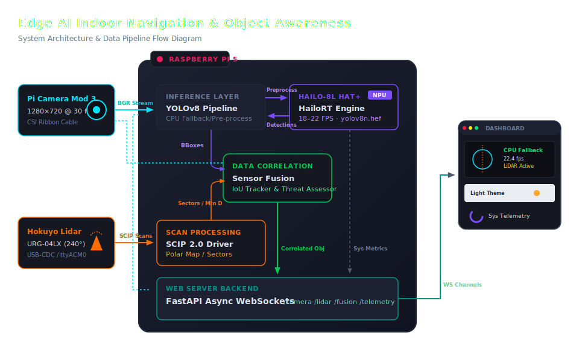

# Edge AI Indoor Navigation & Object Awareness System

**Production-grade real-time perception system for Raspberry Pi 5 + Hailo-8L**

[](https://python.org)
[](https://fastapi.tiangolo.com)
[](LICENSE)
[](https://raspberrypi.com)

---

## Architecture



---

## Hardware Requirements

| Component | Model | Notes |
|-----------|-------|-------|
| SBC | Raspberry Pi 5 (4 GB or 8 GB) | 8 GB recommended |
| AI Accelerator | Hailo AI HAT+ with Hailo-8L | PCIe Gen 3 required |
| Camera | Raspberry Pi Camera Module 3 | CSI ribbon cable |
| LiDAR | Hokuyo URG-04LX-UG-01 | USB-CDC `/dev/ttyACM0` |
| Storage | ≥ 32 GB microSD (A2 class) or NVMe SSD | SSD strongly recommended |
| Power | Official 27W USB-C PD supply | Required for HAT+ |
| Cooling | Active cooler (official or third-party) | Required for sustained load |

---

## Repository Structure

```
edge-ai-navigation/
│
├── app/                        # FastAPI application
│   ├── main.py                 # Application factory + lifespan
│   ├── api/
│   │   └── routes.py           # REST + WebSocket endpoints
│   ├── websocket/
│   │   └── stream.py           # Multi-channel WS manager
│   └── middleware/
│       ├── rate_limit.py       # Sliding-window rate limiter
│       └── auth.py             # API key authentication
│
├── camera/
│   └── capture.py              # picamera2 capture pipeline
│
├── inference/
│   ├── hailo_engine.py         # HailoRT + CPU fallback engine
│   └── yolo_pipeline.py        # YOLO async inference + overlay
│
├── lidar/
│   ├── urg_driver.py           # Hokuyo SCIP 2.0 async driver
│   └── scan_processor.py       # Polar map + obstacle detection
│
├── fusion/
│   ├── sensor_fusion.py        # Camera–LiDAR fusion engine
│   └── object_tracker.py       # IoU-based multi-object tracker
│
├── telemetry/
│   ├── metrics.py              # CPU/mem/temp/FPS + Prometheus
│   └── logger.py               # Rotating JSON log setup
│
├── config/
│   ├── config_loader.py        # Pydantic v2 config models
│   └── settings.yaml           # Runtime configuration
│
├── dashboard/
│   ├── templates/index.html    # Dashboard HTML
│   └── static/
│       ├── css/dashboard.css   # Dark-theme responsive CSS
│       └── js/dashboard.js     # WS clients + canvas + gauges
│
├── tests/
│   ├── unit/test_fusion.py     # Unit tests (no hardware)
│   └── integration/test_api.py # API integration tests
│
├── docs/
│   ├── HAILO_SETUP.md          # HailoRT installation guide
│   ├── PERFORMANCE.md          # Optimisation guide
│   └── TROUBLESHOOTING.md      # Common issues + fixes
│
├── scripts/
│   ├── setup.sh                # Full Pi 5 setup script
│   ├── deploy.sh               # Remote SSH deployment
│   └── download_model.sh       # YOLO model download + ONNX export
│
├── systemd/
│   └── edge-ai-navigation.service
│
├── Dockerfile                  # ARM64 container image
├── docker-compose.yml          # Hardware-passthrough compose
├── requirements.txt
├── pyproject.toml              # pytest + ruff + mypy config
└── README.md
```

---

## Quick Start

### Option A - Direct Install (recommended for production)

```bash
# 1. Clone on the Raspberry Pi
git clone https://github.com/imosudi/edge-ai-navigation.git
cd edge-ai-navigation

# 2. Run setup (installs deps, creates user, udev rules, systemd service)
chmod +x scripts/setup.sh
bash scripts/setup.sh

# 3. Install Hailo SDK (see docs/HAILO_SETUP.md)
# Then compile the model:
bash scripts/download_model.sh yolov8n

# 4. Reboot (required for PCIe Gen 3 + udev rules)
sudo reboot

# 5. Start service
sudo systemctl start edge-ai-navigation

# 6. Open dashboard
# http://<pi-ip>:8080
```

### Option B - Docker (development / testing)

```bash
# Build
docker build --platform linux/arm64 -t edge-ai-nav:latest .

# Run with hardware passthrough
docker-compose up -d

# View logs
docker-compose logs -f edge-ai-nav
```

### Option C - Development Mode (with CPU fallback)

You can configure your local x86 laptop for development and debugging using the setup script:

```bash
# 1. Run the cross-platform setup script (automatically configures local dev mode)
./scripts/setup.sh

# 2. Activate virtual environment
source venv/bin/activate

# 3. Run development server (hardware streams will automatically use mock fallbacks)
EDGE_AI_INFERENCE_DEVICE=cpu \
uvicorn app.main:app --host 0.0.0.0 --port 8080 --reload
```

---

## Configuration

All settings live in `config/settings.yaml`.
Override at runtime with environment variables (prefix `EDGE_AI_`).

### Key settings

```yaml
inference:
  device: "auto"               # hailo | cpu | auto
  confidence_threshold: 0.45   # Detection confidence filter
  model_path: "models/yolov8n.hef"

camera:
  width: 1280
  height: 720
  fps: 30
  jpeg_quality: 80             # WS stream quality (10–100)

lidar:
  port: "/dev/ttyACM0"
  min_range_m: 0.06            # 60 mm minimum
  max_range_m: 5.5

fusion:
  threat_distance_m: 1.0       # HIGH threat threshold
  warn_distance_m:   2.0       # MEDIUM threat threshold

api:
  port: 8080
  require_api_key: false        # Set true + EDGE_AI_API_KEY for security
```

### Dynamic configuration (no restart needed)

```bash
# Update confidence threshold at runtime
curl -X POST http://localhost:8080/api/v1/config \
  -H "Content-Type: application/json" \
  -d '{"confidence_threshold": 0.6, "threat_distance_m": 0.8}'
```

---

## API Reference

### REST Endpoints

| Method | Path | Description |
|--------|------|-------------|
| GET | `/api/v1/status` | System health + component status |
| GET | `/api/v1/detections` | Latest YOLO detections |
| GET | `/api/v1/lidar/scan` | Latest LiDAR scan data |
| GET | `/api/v1/fusion/objects` | Latest fused objects |
| GET | `/api/v1/telemetry` | System metrics snapshot |
| GET | `/api/v1/config` | Current configuration |
| POST | `/api/v1/config` | Update runtime thresholds |
| POST | `/api/v1/snapshot` | Save annotated frame to disk |
| GET | `/api/v1/metrics` | Prometheus metrics text |

Full interactive docs: **http://\<pi-ip\>:8080/api/docs**

### WebSocket Channels

| URL | Data Type | Content |
|-----|-----------|---------|
| `/api/v1/ws/camera` | Binary (JPEG) | Annotated video frames |
| `/api/v1/ws/lidar` | JSON | Polar scan + obstacle zones |
| `/api/v1/ws/fusion` | JSON | Fused tracked objects |
| `/api/v1/ws/telemetry` | JSON | CPU/RAM/temp/FPS metrics |

---

## Fusion Output Format

Each fused object:

```json
{
  "track_id":    7,
  "class_name":  "person",
  "confidence":  0.921,
  "bbox":        [0.31, 0.12, 0.68, 0.94],
  "bearing_deg": -3.2,
  "distance_m":  1.84,
  "direction":   "centre",
  "threat_level": "MEDIUM",
  "timestamp":   1748203200.123
}
```

**Threat levels:**

| Level | Condition |
|-------|-----------|
| `HIGH` | Distance ≤ 1.0 m (configurable) |
| `MEDIUM` | Distance ≤ 2.0 m |
| `LOW` | Distance > 2.0 m |
| `UNKNOWN` | LiDAR data unavailable |

---

## Testing

```bash
# Install test dependencies (included in requirements.txt)
pip install pytest pytest-asyncio httpx

# Run all unit tests (no hardware required)
pytest tests/unit/ -v

# Run integration tests (mocked hardware)
pytest tests/integration/ -v

# Run with coverage
pytest --cov=. --cov-report=html tests/
open htmlcov/index.html

# Lint
ruff check .

# Type check
mypy app/ camera/ inference/ lidar/ fusion/ telemetry/ config/
```

---

## Deployment

### Remote deployment from development machine

```bash
# One-line deploy to Pi (SSH key auth required)
bash scripts/deploy.sh raspberrypi.local pi

# This will:
# 1. rsync code to /opt/edge-ai-navigation/
# 2. pip install -r requirements.txt
# 3. Restart systemd service
# 4. Verify service health
```

### Environment variables for production

```bash
# /opt/edge-ai-navigation/.env
EDGE_AI_API_KEY=<random-hex-32-chars>
EDGE_AI_LOG_LEVEL=INFO
EDGE_AI_INFERENCE_DEVICE=hailo
```

---

## Performance (Raspberry Pi 5 + Hailo-8L)

| Metric | Measured |
|--------|----------|
| Camera capture | 30 fps |
| Hailo-8L inference (YOLOv8n) | 18–22 fps |
| LiDAR scan rate | 10 Hz |
| End-to-end fusion latency | ~60–90 ms |
| WebSocket camera stream | 30 fps |
| CPU utilisation | 45–65% |
| RAM usage | 400–600 MB |
| Steady-state temperature | 55–65°C |

---

## Optional Features

| Feature | How to enable |
|---------|--------------|
| MQTT telemetry | `telemetry.mqtt_enabled: true` in config |
| Prometheus scraping | Add Prometheus to `docker-compose.yml` |
| API key auth | `api.require_api_key: true` + `EDGE_AI_API_KEY` |
| Advanced tracking (SORT) | `fusion/object_tracker.py` ObjectTracker class |
| YOLOv8s upgrade | Compile `yolov8s.hef`; update `model_path` |
| Snapshot recording | `POST /api/v1/snapshot` |

---

## Security Recommendations

1. **Enable API key authentication** for remote access
2. **Firewall**: Restrict port 8080 to LAN only (`ufw allow from 192.168.0.0/24 to any port 8080`)
3. **HTTPS**: Use nginx reverse proxy with Let's Encrypt for remote access
4. **Secrets**: Never commit `.env` - use environment variables
5. **Updates**: `sudo apt upgrade` monthly for security patches

---

## Academic / Research Use

This system is designed to be **benchmarkable**:

- FPS metrics per pipeline stage exposed via `/api/v1/metrics` (Prometheus format)
- Per-inference latency logged in structured JSON
- Snapshot mode for offline dataset collection
- CPU fallback mode enables reproduction without Hailo hardware
- `FPSCounter` class in `telemetry/metrics.py` for custom stage timing

Cite as:
```
Edge AI Indoor Navigation System (2025).
Raspberry Pi 5 + Hailo-8L real-time perception pipeline.
GitHub: github.com/imosudi/edge-ai-navigation
```

---

## License

MIT License - see [LICENSE](LICENSE) file.

---

## Author

**Mio** · FH Technikum Wien · IoT Systems Development  
GitHub: [@imosudi](https://github.com/imosudi)
